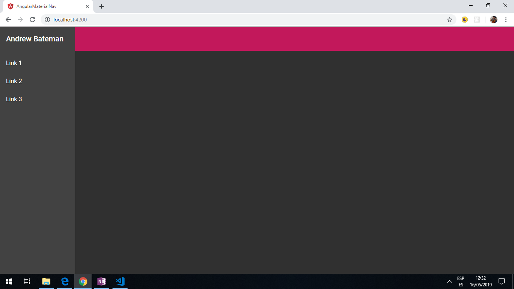

# :zap: Angular Material Nav

Angular app using [Angular Material](https://material.angular.io/) and [Angular Material Schematics](https://material.angular.io/guide/schematics) to create a responsive side navigation menu.

*** Note: to open web links in a new window use: _ctrl+click on link_**

## :page_facing_up: Table of contents

* [:zap: Angular Material Nav](#zap-angular-material-nav)
  * [:page_facing_up: Table of contents](#pagefacingup-table-of-contents)
  * [:books: General info](#books-general-info)
  * [:camera: Screenshots](#camera-screenshots)
  * [:signal_strength: Technologies](#signalstrength-technologies)
  * [:floppy_disk: Setup](#floppydisk-setup)
  * [:computer: Code Examples](#computer-code-examples)
  * [:cool: Features](#cool-features)
  * [:clipboard: Status & To-Do List](#clipboard-status--to-do-list)
  * [:clap: Inspiration](#clap-inspiration)
  * [:envelope: Contact](#envelope-contact)

## :books: General info

* Sidenav menu is hidden at a screen width of 600px or less using a break-point `isHandset$` as an observable.
* Angular Material Schematics used to create the navigation component.

## :camera: Screenshots



## :signal_strength: Technologies

* [Angular framework v9](https://angular.io/)
* [Angular Material v9](https://material.angular.io/)

## :floppy_disk: Setup

* Run `npm i` to install dependencies. Run `ng serve` for a dev server. Navigate to `http://localhost:4200/`. The app will automatically reload if you change any of the source files.

## :computer: Code Examples

* `navigation.component.ts` nav component showing use of observable isHandset that is set true or false and controls if sidebar menu open or closed

```typescript
export class NavigationComponent {

  isHandset$: Observable<boolean> = this.breakpointObserver.observe(Breakpoints.Handset)
    .pipe(
      map(result => result.matches)
    );

  constructor(private breakpointObserver: BreakpointObserver) {}

}
```

## :cool: Features

* sidebar collapses to burger when screen width < 960px (small tablet handset). App doesn't do much else - just demonstrates @angular breakpointObserver.
* [Breakpoint system](https://material.io/design/layout/responsive-layout-grid.html#breakpoints) used to decide when top menu goes to side menu burger. [Angular breakpoints using the Material design system explained here](https://material.angular.io/cdk/layout/overview).

## :clipboard: Status & To-Do List

* Status: Working. Updated to latest Angular 9 and all dependencies updated
* To-Do: Nothing

## :clap: Inspiration

* [Medium article by Ahmed Abouzied: Angular Material Responsive Navigation](https://medium.com/@ahmedaabouzied/angular-material-responsive-navigation-53b573305d3d)

## :envelope: Contact

* Repo created by [ABateman](https://www.andrewbateman.org) - you are welcome to [send me a message](https://andrewbateman.org/contact)
