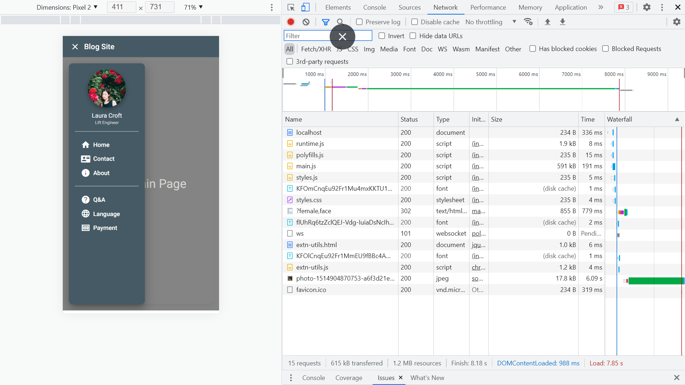

# :zap: Angular Material Nav

* Angular app using [Angular Material](https://material.angular.io/) & [Angular Material Schematics](https://material.angular.io/guide/schematics) to create a responsive side navigation menu.
* **Note:** to open web links in a new window use: _ctrl+click on link_


## :page_facing_up: Table of contents

* [:zap: Angular Material Nav](#zap-angular-material-nav)
  * [:page_facing_up: Table of contents](#page_facing_up-table-of-contents)
  * [:books: General info](#books-general-info)
  * [:camera: Screenshots](#camera-screenshots)
  * [:signal_strength: Technologies](#signal_strength-technologies)
  * [:floppy_disk: Setup](#floppy_disk-setup)
  * [:computer: Code Examples](#computer-code-examples)
  * [:cool: Features](#cool-features)
  * [:clipboard: Status & To-Do List](#clipboard-status--to-do-list)
  * [:clap: Inspiration](#clap-inspiration)
  * [:file_folder: License](#file_folder-license)
  * [:envelope: Contact](#envelope-contact)

## :books: General info

* Sidenav menu is hidden at a screen width of 600px or less using a break-point `isHandset$` as an observable.
* Angular Material Schematics used to create the navigation component.


## :camera: Screenshots



## :signal_strength: Technologies

* [Angular v13](https://angular.io/) JS framework
* [Angular Material v13](https://material.angular.io/)
* [Material Design Screen breakpoints](https://material.io/design/layout/responsive-layout-grid.html#breakpoints) & [Angular Breakpoint state](https://material.angular.io/cdk/layout/api) used to determine when side menu appears
* [Angular Material Sidenav](https://material.angular.io/components/sidenav/overview) modes are default 'over', 'side' and 'push'. Accessibility: add role attribute
* [Angular Material Icons](https://www.angularjswiki.com/angular/angular-material-icons-list-mat-icon-list/) list of icons, categorized but not searchable
* [Unsplash random face image](https://awik.io/generate-random-images-unsplash-without-using-api/) used for profile

## :floppy_disk: Setup

* Run `npm i` to install dependencies. Run `ng serve` for a dev server.
* Navigate to `http://localhost:4200/`. The app will automatically reload if you change any of the source files.
* To deploy to Github, in angular.json file change output directory to 'docs'
* Run `ng build --prod --baseHref="https://github.com/AndrewJBateman/angular-material-nav/` then commit to Github as usual

## :computer: Code Examples

* `navigation.component.ts` nav component showing use of observable that is set true or false and controls if sidebar menu open or closed

```typescript
// breakpoint observer checks if width is over 700px.
// If so use 'over' mode and close side nav
// If less than 700px use 'side' mode & open side nav
ngAfterViewInit() {
  this.observer
    .observe(["(max-width: 700px)"])
    .pipe(delay(1)) // delay 1mS
    .subscribe((res) => {
      if (res.matches) {
        this.sidenav.mode = "over";
        this.sidenav.close();
      } else {
        this.sidenav.mode = "side";
        this.sidenav.open();
      }
    });
}
```

## :cool: Features

* sidebar collapses to burger when screen width < 960px (small tablet handset). App doesn't do much else - just demonstrates @angular breakpointObserver.
* [Angular breakpoints using the Material design system explained here](https://material.angular.io/cdk/layout/overview).

## :clipboard: Status & To-Do List

* Status: Working.
* To-Do: Nothing

## :clap: Inspiration

* [Angular Material Breakpoint documentation](https://material.angular.io/cdk/layout/api)

## :file_folder: License

* This project is licensed under the terms of the MIT license.

## :envelope: Contact

* Repo created by [ABateman](https://github.com/AndrewJBateman), email: gomezbateman@yahoo.com
